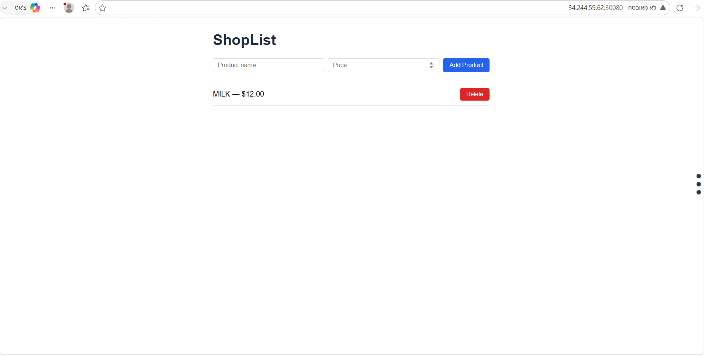

# Final Pipeline Results

## Project Details

- **Project Name:** DevOps Final Project 2026
- **Submitted by:** Nechama Spiegler
- **GitHub Repo (Public):** [nechami-abc/DevOps-final-project](https://github.com/nechami-abc/DevOps-final-project)
- **Live App Address:** [http://34.244.59.62:30080](http://34.244.59.62:30080/)

---

## Pipeline Links (GitHub Actions)

### 1. Create Infra (Infrastructure Setup)
Pipeline for setting up the infrastructure (Terraform + Ansible) that created the machine and ran the application on it:

[Create/Destroy Lab Infra – Run #29347253949](https://github.com/nechami-abc/DevOps-final-project/actions/runs/29347253949)

### 2. Confirm Infra (Confirmation/Validation)
Pipeline to confirm the infrastructure was successfully created:

[Create/Destroy Lab Infra – Run #29347582185](https://github.com/nechami-abc/DevOps-final-project/actions/runs/29347582185)

### 3. Build, Push and Deploy (CI/CD)
Pipeline for building Docker images, pushing them to the Registry, and deploying them:

[Build, Push and Deploy – Run #29346993138](https://github.com/nechami-abc/DevOps-final-project/actions/runs/29346993138)

### 4. Destroy Infra (Tearing Down the Infrastructure)
Pipeline to remove all infrastructure at the end of the documentation process:

[Destroy Infra — Plan · Run #29420309828](https://github.com/nechami-abc/DevOps-final-project/actions/runs/29420309828)

[Destroy Infra — Confirm · Run #29420517904](https://github.com/nechami-abc/DevOps-final-project/actions/runs/29420517904)

---

## Screenshot – Application Running on the Machine

The application (ShopList) is running and successfully accessible at the public address:
`http://34.244.59.62:30080`

---

## Status

| Stage | Status |
|---|---|
| Create Infra | Passed successfully |
| Confirm Infra | Passed successfully |
| Build, Push and Deploy (CI/CD) | Passed successfully |
| Application working at public address | Screenshot attached |
| Destroy Infra (after documentation completed) | Completed successfully |

---

### Completed
All documentation (links + screenshot) has been saved, and the Destroy pipeline was run successfully (Plan + Confirm) — the infrastructure has been removed from the cloud.
